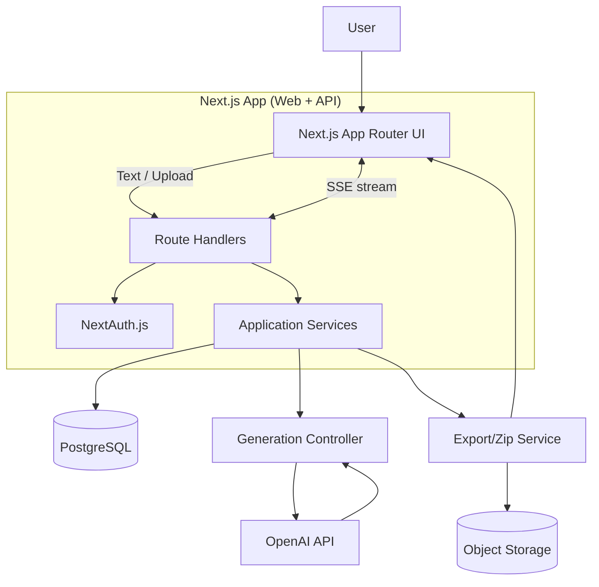

# Architecture — AI PM Assistant (Next.js Full‑Stack)

This document outlines the application architecture for the AI PM Assistant PoC, aligning with the PRD and implementing a Next.js full‑stack solution with PostgreSQL, OpenAI API, and a chat‑based refinement loop.

---

## Goals Alignment
- O1 — Documentation Suite Generation: Project Overview, Feature List, User Stories, Roadmap
- O2 — Interactive Refinement Interface: Chat UX with section‑level updates
- O3 — Validated PoC Deployment: Deployed prototype producing results in < 5 minutes
- Functional Requirements FR1–FR8 covered via modules below

---

## High‑Level System Diagram



Notes:
- API routes handle synchronous and streamed responses (SSE) for LLM output.
- Exports are generated on the fly and streamed or written to object storage.
- Authentication is session‑based using NextAuth with a Prisma + PostgreSQL adapter.

---

## Technology Stack
- Next.js (App Router, Server Components, Route Handlers)
- NextAuth.js (Credentials/Providers)
- PostgreSQL
- Prisma ORM
- OpenAI API (text generation and refinement)
- AWS S3 (or equivalent) for file uploads and ZIP storage
- Vercel for hosting (web + serverless API)

---

## Core Modules
1) Authentication
- NextAuth session management; protects dashboards and project data.
- Minimal RBAC: user can access only own projects.

2) Project & Document Management
- Entities: User, Project, Document, DocumentRevision.
- Document types: project_overview, feature_list, user_stories, roadmap.
- Each generation creates a new revision; latest is active by default.

3) AI Generation & Refinement
- Generation Controller encapsulates prompts, model selection, and retries.
- Section‑level update engine allows targeted regeneration of specific sections.
- Chat Threads with Messages provide iterative refinement context.

4) File Ingestion
- PDF/DOCX upload endpoint parses text (server‑side) and stores structured input.

5) Export
- Export full suite (Markdown + JSON) as a ZIP; provide download link or stream.

6) Observability & Reliability
- Structured logging per request; capture token usage, latency, and failures.
- Rate limiting per user on generation endpoints.
- Idempotency keys to avoid duplicate task execution on retries.

---

## Request Lifecycle (Happy Path)
1. Authenticated user creates a Project.
2. User provides a text brief or uploads PDF/DOCX.
3. User triggers “Generate Suite”: API calls Generation Controller per doc type.
4. LLM responses are streamed to UI; persisted as Document + first Revision.
5. User uses chat to refine specific sections → new Revisions are created.
6. User exports ZIP containing Markdown + JSON for all documents and metadata.

---

## Data Flow Responsibilities
- Route Handlers: validate input, authorize, call services, shape responses.
- Services: pure business logic for documents, chat, generation, export.
- Repositories: encapsulate DB CRUD (per table) via Prisma.
- External Clients: OpenAI, Storage.

---

## API Surface
- POST `api/auth/*` — NextAuth
- POST `api/projects` — create project
- GET `api/projects` — list projects
- GET `api/projects/:projectId` — get project
- POST `api/uploads` — upload source files (PDF/DOCX)
- POST `api/ai/generate` — generate initial suite (can stream)
- POST `api/ai/refine` — refine a section or document (can stream)
- GET `api/documents/:projectId` — list documents
- GET `api/documents/:documentId` — get document + latest revision
- POST `api/exports/:projectId` — export ZIP

Note: Endpoints use session auth; responses are in Markdown and JSON where applicable.

---

## UI/UX (App Router)
- `app/(auth)/signin` — sign in
- `app/dashboard` — user projects
- `app/project/[projectId]` — editor, preview, chat panel
- `app/project/[projectId]/export` — export/download flow

---

## Directory Structure
```
app/
  api/
    auth/[...nextauth]/route.ts
    projects/route.ts
    projects/[projectId]/route.ts
    uploads/route.ts
    ai/
      generate/route.ts
      refine/route.ts
    documents/
      [documentId]/route.ts
    exports/
      [projectId]/route.ts
  (auth)/
    signin/page.tsx
  dashboard/page.tsx
  project/[projectId]/page.tsx
lib/
  db/ (Prisma client & repositories)
  ai/ (OpenAI client, prompt builders, controller)
  services/ (DocumentService, ChatService, ExportService, UploadService)
  auth/ (NextAuth config)
  utils/
prisma/
  schema.prisma
```

---

## Security & Compliance
- Session‑based auth; per‑resource authorization checks.
- Input validation and sanitization; file type/size whitelisting for uploads.
- Secrets via environment variables; never exposed client‑side.
- PII minimization; documents are user‑generated; no external user data.

---

## Performance & Cost
- Stream LLM responses to reduce perceived latency.
- Cache last good revision in memory per request if needed.
- Compact prompts; reuse context across refinement steps.
- Backoff/retry with jitter on API errors; short circuit for repeated failures.

---

## Deployment
- Vercel: Next.js app and API routes.
- Managed PostgreSQL (e.g., Neon, Supabase, Render).
- Custom domain with HTTPS.

---

## Mapping to FRs
- FR1 Input handling: file uploads + text inputs.
- FR2 Core generation: `/api/ai/generate` → OpenAI integration.
- FR3 Output suite: 4 docs created.
- FR4 Structured output: Markdown render + JSON persist.
- FR5 Refinement loop: chat threads; streamed updates.
- FR6 Plan modification: section‑level updates → new revisions.
- FR7 Export: ZIP endpoint.
- FR8 Authentication: NextAuth.

---

## Risks & Mitigations
- Model inaccuracies → human‑in‑the‑loop via chat and revisions.
- API outages → retry/backoff; present error in UI with recovery.
- Long generation times → streaming; chunked operations per document.


