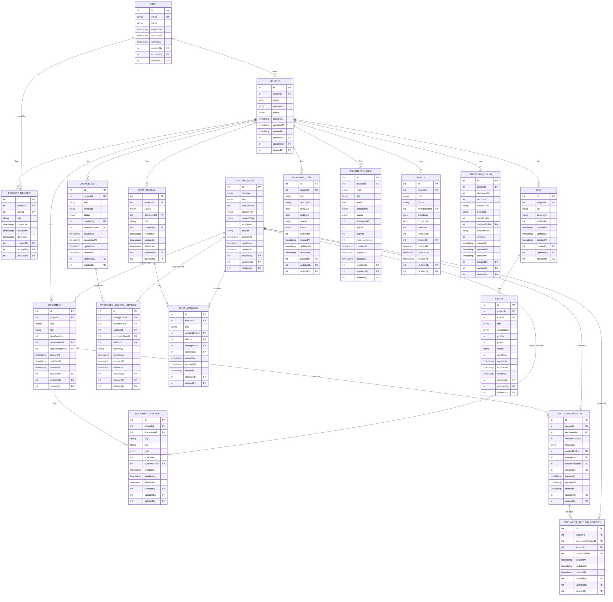

# Prism MVP – Database Design Document

This document describes the **database design** for the Prism MVP.  
It is written to be **simple, explicit, and readable** for both humans and tools like Cursor.

The design supports:
- Project documentation
- Epics, user stories, and roadmap planning
- AI-generated content with traceability
- Semantic search and “chat with project” via vector embeddings

---

## 1. Design Principles

- One project is the **root container**
- Documents are **canonical** (one per type per project)
- Planning data (epics, stories, roadmap) is **structured**
- AI-generated content is **traceable**
- Vector search is **project-scoped**
- MVP-first: no premature optimization
- IDs are incremental integers across all entities
- Every entity includes audit fields: `createdAt`, `updatedAt`, `deletedAt`, `createdBy`, `updatedBy`, `deletedBy`

---

## 2. Core Entities Overview

High-level relationships:

```text
User
└─ Project
   ├─ ProjectMember (User membership)
   ├─ Document
   │  ├─ DocumentSection
   │  ├─ DocumentVersion
   │  │  └─ DocumentSectionVersion
   │  └─ (rendered) ContentBlob (optional)
   ├─ ChangeSet
   │  └─ ProposedSectionChange
   ├─ ChatThread
   │  └─ ChatMessage
   ├─ Epic
   │  └─ Story
   ├─ RoadmapItem
   ├─ AssumptionRisk
   ├─ EmbeddingChunk
   └─ AiRun
```


---

## 3. Tables

## 3.0 ER Diagram



---

## 3.1 User

**Purpose**  
Represents a system user and project owner.

**Fields**
- `id` (PK, incremental)
- `email` (unique)
- `name`
- `createdAt`
- `updatedAt`
- `deletedAt`
- `createdBy`
- `updatedBy`
- `deletedBy`

---

## 3.2 Project

**Purpose**  
Top-level container for all documents and planning data.

**Fields**
- `id` (PK, incremental)
- `ownerId` (FK → User)
- `name`
- `description`
- `status` (`DRAFT | ACTIVE | ARCHIVED`)
- `createdAt`
- `updatedAt`
- `deletedAt`
- `createdBy`
- `updatedBy`
- `deletedBy`

**Indexes**
- `(ownerId, createdAt)`

---

## 3.3 Document

**Purpose**  
Stores canonical project documents; rendered content is stored via `ContentBlob`. Versioning and edits operate at both document and section levels.

**Document Types**
- `PROJECT_BRIEF`
- `SCOPE_FEATURES`
- `EPICS`
- `USER_STORIES`
- `ROADMAP`
- `ASSUMPTIONS_RISKS`

**Fields**
- `id` (PK, incremental)
- `projectId` (FK → Project)
- `type` (enum)
- `title`
- `latestVersion` (int)
- `currentBlobId` (FK → ContentBlob)
- `lastChangeSetId` (FK → ChangeSet)
- `createdAt`
- `updatedAt`
- `deletedAt`
- `createdBy`
- `updatedBy`
- `deletedBy`

**Rules**
- Exactly one document per type per project

**Constraints**
- `UNIQUE (projectId, type)`

---

## 3.4 Epic

**Purpose**  
High-level deliverables derived from product scope (ordered list).

**Fields**
- `id` (PK, incremental)
- `projectId` (FK → Project)
- `title`
- `description`
- `sortOrder` (int)
- `createdAt`
- `updatedAt`
- `deletedAt`
- `createdBy`
- `updatedBy`
- `deletedBy`

**Constraints**
- `UNIQUE (projectId, code)`

---

## 3.5 Story

**Purpose**  
Actionable work items linked to epics; simple prioritization and ordering.

**Fields**
- `id` (PK, incremental)
- `projectId` (FK → Project)
- `epicId` (FK → Epic)
- `title`
- `description`
- `priority` (int; 0–3 typical)
- `points`
- `status` (`PLANNED | IN_PROGRESS | DONE | BLOCKED`)
- `sortOrder` (int)
- `createdAt`
- `updatedAt`
- `deletedAt`
- `createdBy`
- `updatedBy`
- `deletedBy`

**Constraints**
- `UNIQUE (projectId, code)`

---

## 3.6 RoadmapItem

**Purpose**  
Represents time-based planning units (optionally by quarter) with ordering.

**Fields**
- `id` (PK, incremental)
- `projectId` (FK → Project)
- `title`
- `description`
- `startDate`
- `endDate`
- `quarter`
- `status` (`PLANNED | IN_PROGRESS | DONE | BLOCKED`)
- `sortOrder` (int)
- `createdAt`
- `updatedAt`
- `deletedAt`
- `createdBy`
- `updatedBy`
- `deletedBy`

---

## 3.7 AssumptionRisk

**Purpose**  
Tracks assumptions and risks across the project.

**Fields**
- `id` (PK, incremental)
- `projectId` (FK → Project)
- `type` (`ASSUMPTION | RISK`)
- `title`
- `detail`
- `confidence` (`LOW | MEDIUM | HIGH`)
- `status` (`OPEN | MITIGATED | CLOSED`)
- Optional links:
  - `documentId`
  - `epicId`
  - `storyId`
  - `roadmapItemId`
- `createdAt`
- `updatedAt`
- `deletedAt`
- `createdBy`
- `updatedBy`
- `deletedBy`

---

## 3.8 AiRun

**Purpose**  
Audit log for AI-generated content.

**Fields**
- `id` (PK, incremental)
- `projectId` (FK → Project)
- `type` (`GENERATE_PROJECT | CHAT_EDIT | REGENERATE_SECTION`)
- `model`
- `promptBlobId` (FK → ContentBlob)
- `inputJson` (JSON)
- `outputJson` (JSON)
- `tokensIn`
- `tokensOut`
- `createdBy` (FK → User)
- `createdAt`
- `updatedAt`
- `deletedAt`
- `updatedBy`
- `deletedBy`

**Usage**
- Linked from Document, Epic, Story, RoadmapItem
- Enables traceability and debugging

---

## 3.9 ProjectMember

**Purpose**  
Associates users to projects with a flexible role.

**Fields**
- `id` (PK, incremental)
- `projectId` (FK → Project)
- `userId` (FK → User)
- `role` (string; e.g., `MEMBER`, flexible for future roles)
- `createdAt`
- `updatedAt`
- `deletedAt`
- `createdBy`
- `updatedBy`
- `deletedBy`

**Constraints**
- `UNIQUE (projectId, userId)`

**Indexes**
- `(userId)`

---

## 3.10 ContentBlob

**Purpose**  
Storage abstraction for content (Markdown/JSON/diff), supporting Postgres or external blob storage (e.g., R2).

**Fields**
- `id` (PK, incremental)
- `provider` (`POSTGRES | R2`)
- `kind` (`MARKDOWN | JSON | DIFF`)
- `textContent` (when provider = POSTGRES)
- `storageKey` (when provider = R2)
- `contentType` (e.g., `text/markdown`, `application/json`)
- `sizeBytes`
- `sha256`
- `createdAt`
- `updatedAt`
- `deletedAt`
- `createdBy`
- `updatedBy`
- `deletedBy`

**Indexes**
- `(provider)`, `(sha256)`

---

## 3.11 DocumentSection

**Purpose**  
Addresses and organizes sub-parts of a document for targeted AI edits and diffs.

**Fields**
- `id` (PK, incremental)
- `projectId` (FK → Project)
- `documentId` (FK → Document)
- `key` (stable identifier; e.g., `brief.problem`)
- `title` (optional)
- `type` (`HEADING | PARAGRAPH | LIST | TABLE | CODE | CALLOUT`)
- `sortOrder` (int)
- `currentBlobId` (FK → ContentBlob)
- `createdAt`, `updatedAt`
- `deletedAt`
- `createdBy`, `updatedBy`, `deletedBy`

**Constraints**
- `UNIQUE (documentId, key)`

**Indexes**
- `(documentId, sortOrder)`, `(projectId)`

---

## 3.12 DocumentVersion

**Purpose**  
Immutable snapshot representing an applied change to a document.

**Fields**
- `id` (PK, incremental)
- `projectId` (FK → Project)
- `documentId` (FK → Document)
- `versionNumber` (int)
- `message`
- `contentBlobId` (FK → ContentBlob; rendered doc at that version)
- `changeSetId` (FK → ChangeSet)
- `sourceAiRunId` (FK → AiRun)
- `createdBy` (FK → User)
- `createdAt`, `updatedAt`, `deletedAt`
- `updatedBy`, `deletedBy`

**Constraints**
- `UNIQUE (documentId, versionNumber)`

**Indexes**
- `(projectId, createdAt)`, `(changeSetId)`

---

## 3.13 DocumentSectionVersion

**Purpose**  
Stores only the sections that changed within a `DocumentVersion`.

**Fields**
- `id` (PK, incremental)
- `projectId` (FK → Project)
- `documentVersionId` (FK → DocumentVersion)
- `sectionId` (FK → DocumentSection)
- `contentBlobId` (FK → ContentBlob)
- `createdAt`, `updatedAt`, `deletedAt`
- `createdBy`, `updatedBy`, `deletedBy`

**Constraints**
- `UNIQUE (documentVersionId, sectionId)`

**Indexes**
- `(sectionId)`

---

## 3.14 ChangeSet

**Purpose**  
Commit-like grouping of updates across one or more documents/sections.

**Fields**
- `id` (PK, incremental)
- `projectId` (FK → Project)
- `title`
- `message`
- `status` (`PROPOSED | COMMITTED | DISCARDED`)
- `createdAt`, `committedAt`
- `createdBy` (FK → User)
- `sourceAiRunId` (FK → AiRun)
- `updatedAt`, `deletedAt`
- `updatedBy`, `deletedBy`

**Indexes**
- `(projectId, createdAt)`, `(status)`

---

## 3.15 ProposedSectionChange

**Purpose**  
Holds proposed content and optional diff for preview before applying to create versions.

**Fields**
- `id` (PK, incremental)
- `changeSetId` (FK → ChangeSet)
- `documentId` (FK → Document)
- `sectionId` (FK → DocumentSection)
- `proposedBlobId` (FK → ContentBlob)
- `diffBlobId` (FK → ContentBlob)
- `summary`
- `createdAt`, `updatedAt`, `deletedAt`
- `createdBy`, `updatedBy`, `deletedBy`

**Constraints**
- `UNIQUE (changeSetId, sectionId)`

**Indexes**
- `(documentId)`, `(sectionId)`

---

## 3.16 ChatThread

**Purpose**  
Project-scoped or document-scoped chat threads that may produce proposed changes.

**Fields**
- `id` (PK, incremental)
- `projectId` (FK → Project)
- `scope` (`PROJECT | DOCUMENT`)
- `documentId` (FK → Document)
- `title`
- `createdBy` (FK → User)
- `createdAt`, `updatedAt`, `deletedAt`
- `updatedBy`, `deletedBy`

**Indexes**
- `(projectId, updatedAt)`, `(documentId)`

---

## 3.17 ChatMessage

**Purpose**  
Messages within a thread, with content stored via `ContentBlob`, optionally linked to `AiRun` or `ChangeSet`.

**Fields**
- `id` (PK, incremental)
- `threadId` (FK → ChatThread)
- `role` (`USER | ASSISTANT | SYSTEM`)
- `contentBlobId` (FK → ContentBlob)
- `aiRunId` (FK → AiRun)
- `changeSetId` (FK → ChangeSet)
- `createdBy` (FK → User)
- `createdAt`, `updatedAt`, `deletedAt`
- `updatedBy`, `deletedBy`

**Indexes**
- `(threadId, createdAt)`, `(aiRunId)`, `(changeSetId)`

---

## 4. Vector Database Design (pgvector)

**Technology**
- Postgres + `pgvector`

**Purpose**
- Semantic search
- Project-scoped AI chat
- Consistency checks
- Impact analysis

---

## 4.1 EmbeddingChunk

**Purpose**  
Stores vector embeddings for semantic retrieval.

**Fields**
- `id` (PK, incremental)
- `projectId` (FK → Project)
- `documentId` (optional)
- `sectionId` (optional)
- `sourceType` (string; e.g., `Document`, `Section`, `Epic`, `Story`)
- `sourceId` (optional ID of source entity)
- `chunkIndex` (int)
- `contentBlobId` (FK → ContentBlob)
- `contentHash` (string)
- `version` (integer)
- `createdAt`, `updatedAt`, `deletedAt`
- `createdBy`, `updatedBy`, `deletedBy`

**Rules**
- Only embed meaningful text
- Re-embed only if `contentHash` changes
- Always filter by `projectId` during retrieval

---

## 5. Data Consistency Rules

- Documents derive from Project Brief
- Epics must map to exactly one feature (conceptually)
- Stories must map to exactly one epic
- Roadmap items must reference existing epics
- AI output must be validated before persistence
- Vector embeddings must stay in sync with source content
- Document versions must correspond to applied ChangeSets
- Section versions must correspond to changed sections only

---

## 6. MVP Scope Summary

**Included**
- Project
- Documents (Markdown)
- Epics
- Stories
- Roadmap
- Assumptions/Risks
- AI audit logging
- Vector embeddings

**Excluded (for now)**
- Team collaboration
- Permissions/roles
- Comments
- External integrations
- Analytics

---

## 7. Why This Design Works

- Simple enough for MVP
- Structured enough for AI
- Traceable and debuggable
- Easy to extend without breaking existing data
- Compatible with Prisma + pgvector

---

This document is the **canonical database reference** for the Prism MVP.