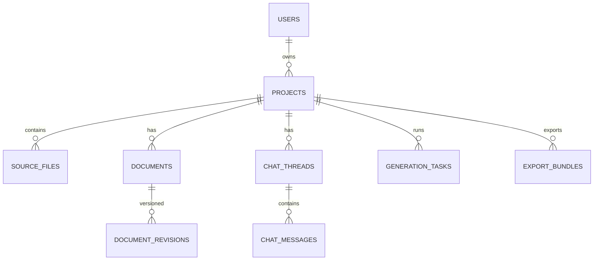

# Database Design — AI PM Assistant (PostgreSQL)

This document defines the PostgreSQL relational schema for the AI PM Assistant, aligned with the PRD. It focuses on normalized tables, explicit foreign keys, indexing for access patterns, and transactional integrity for generation and refinement.

---

## Storage
- PostgreSQL (managed: Neon/Supabase/Render)
- NextAuth.js with Prisma PostgreSQL adapter
- Object storage (e.g., S3) for uploads and ZIP bundles; keys/URLs referenced in DB

---

## Tables & Columns

### users (NextAuth)
- id: uuid PRIMARY KEY
- name: text
- email: citext UNIQUE NOT NULL
- image: text NULL
- created_at: timestamptz NOT NULL DEFAULT now()
- updated_at: timestamptz NOT NULL DEFAULT now()

### projects
- id: uuid PRIMARY KEY
- owner_id: uuid NOT NULL REFERENCES users(id) ON DELETE CASCADE
- name: text NOT NULL
- brief: text NOT NULL
- status: project_status NOT NULL DEFAULT 'draft'
- created_at: timestamptz NOT NULL DEFAULT now()
- updated_at: timestamptz NOT NULL DEFAULT now()

Indexes:
- UNIQUE (owner_id, name)
- (owner_id, created_at DESC)

### source_files
- id: uuid PRIMARY KEY
- project_id: uuid NOT NULL REFERENCES projects(id) ON DELETE CASCADE
- original_name: text NOT NULL
- mime_type: text NOT NULL
- size_bytes: bigint NOT NULL
- storage_key: text NULL
- url: text NULL
- extracted_text: text NULL
- created_at: timestamptz NOT NULL DEFAULT now()

Indexes:
- (project_id, created_at DESC)

### documents
- id: uuid PRIMARY KEY
- project_id: uuid NOT NULL REFERENCES projects(id) ON DELETE CASCADE
- type: document_type NOT NULL
- title: text NOT NULL
- current_revision_id: uuid NULL REFERENCES document_revisions(id)
- created_at: timestamptz NOT NULL DEFAULT now()
- updated_at: timestamptz NOT NULL DEFAULT now()

Indexes:
- UNIQUE (project_id, type)
- (project_id, updated_at DESC)

### document_revisions
- id: uuid PRIMARY KEY
- document_id: uuid NOT NULL REFERENCES documents(id) ON DELETE CASCADE
- version: integer NOT NULL
- content_markdown: text NOT NULL
- content_json: jsonb NOT NULL
- model: text NOT NULL
- prompt_snapshot: jsonb NOT NULL
- usage_prompt_tokens: integer NULL
- usage_completion_tokens: integer NULL
- usage_total_tokens: integer NULL
- created_by: uuid NOT NULL REFERENCES users(id) ON DELETE SET NULL
- created_at: timestamptz NOT NULL DEFAULT now()

Constraints:
- UNIQUE (document_id, version)

Indexes:
- (document_id, version DESC)
- (document_id, created_at DESC)

### chat_threads
- id: uuid PRIMARY KEY
- project_id: uuid NOT NULL REFERENCES projects(id) ON DELETE CASCADE
- title: text NOT NULL
- document_id: uuid NULL REFERENCES documents(id) ON DELETE SET NULL
- section_key: text NULL
- created_at: timestamptz NOT NULL DEFAULT now()

Indexes:
- (project_id, created_at DESC)

### chat_messages
- id: uuid PRIMARY KEY
- thread_id: uuid NOT NULL REFERENCES chat_threads(id) ON DELETE CASCADE
- author_type: message_author NOT NULL
- author_id: uuid NULL REFERENCES users(id) ON DELETE SET NULL
- content: text NOT NULL
- related_document_id: uuid NULL REFERENCES documents(id) ON DELETE SET NULL
- created_at: timestamptz NOT NULL DEFAULT now()

Indexes:
- (thread_id, created_at ASC)

### generation_tasks
- id: uuid PRIMARY KEY
- project_id: uuid NOT NULL REFERENCES projects(id) ON DELETE CASCADE
- document_id: uuid NULL REFERENCES documents(id) ON DELETE SET NULL
- type: task_type NOT NULL
- status: task_status NOT NULL
- params: jsonb NOT NULL
- error: jsonb NULL
- metrics_tokens: integer NULL
- metrics_duration_ms: integer NULL
- created_at: timestamptz NOT NULL DEFAULT now()
- updated_at: timestamptz NOT NULL DEFAULT now()

Indexes:
- (project_id, created_at DESC)
- (status, created_at DESC)

### export_bundles
- id: uuid PRIMARY KEY
- project_id: uuid NOT NULL REFERENCES projects(id) ON DELETE CASCADE
- file_key: text NULL
- url: text NULL
- size_bytes: bigint NULL
- created_at: timestamptz NOT NULL DEFAULT now()

Indexes:
- (project_id, created_at DESC)

---

## Entity Relationships (Mermaid ER)



Legend:
- USERS ↔ NextAuth `users` table
- Arrows show primary ownership; all relationships use foreign keys with cascading rules

---

## Example DDL (simplified)

```sql
-- Enums
CREATE TYPE project_status AS ENUM ('draft', 'active', 'archived');
CREATE TYPE document_type AS ENUM ('project_overview', 'feature_list', 'user_stories', 'roadmap');
CREATE TYPE message_author AS ENUM ('user', 'assistant', 'system');
CREATE TYPE task_type AS ENUM ('initial_suite', 'regenerate_document', 'section_update');
CREATE TYPE task_status AS ENUM ('queued', 'running', 'succeeded', 'failed');

-- Users
CREATE TABLE users (
  id uuid PRIMARY KEY DEFAULT gen_random_uuid(),
  name text,
  email citext UNIQUE NOT NULL,
  image text,
  created_at timestamptz NOT NULL DEFAULT now(),
  updated_at timestamptz NOT NULL DEFAULT now()
);

-- Projects
CREATE TABLE projects (
  id uuid PRIMARY KEY DEFAULT gen_random_uuid(),
  owner_id uuid NOT NULL REFERENCES users(id) ON DELETE CASCADE,
  name text NOT NULL,
  brief text NOT NULL,
  status project_status NOT NULL DEFAULT 'draft',
  created_at timestamptz NOT NULL DEFAULT now(),
  updated_at timestamptz NOT NULL DEFAULT now(),
  UNIQUE(owner_id, name)
);

-- Documents
CREATE TABLE documents (
  id uuid PRIMARY KEY DEFAULT gen_random_uuid(),
  project_id uuid NOT NULL REFERENCES projects(id) ON DELETE CASCADE,
  type document_type NOT NULL,
  title text NOT NULL,
  current_revision_id uuid NULL,
  created_at timestamptz NOT NULL DEFAULT now(),
  updated_at timestamptz NOT NULL DEFAULT now(),
  UNIQUE(project_id, type)
);

-- Document Revisions
CREATE TABLE document_revisions (
  id uuid PRIMARY KEY DEFAULT gen_random_uuid(),
  document_id uuid NOT NULL REFERENCES documents(id) ON DELETE CASCADE,
  version integer NOT NULL,
  content_markdown text NOT NULL,
  content_json jsonb NOT NULL,
  model text NOT NULL,
  prompt_snapshot jsonb NOT NULL,
  usage_prompt_tokens integer,
  usage_completion_tokens integer,
  usage_total_tokens integer,
  created_by uuid REFERENCES users(id) ON DELETE SET NULL,
  created_at timestamptz NOT NULL DEFAULT now(),
  UNIQUE(document_id, version)
);

-- FK to revisions after both tables exist
ALTER TABLE documents
  ADD CONSTRAINT documents_current_rev_fk
  FOREIGN KEY (current_revision_id) REFERENCES document_revisions(id) ON DELETE SET NULL;
```

---

## Access Patterns
- List projects for current user: `SELECT * FROM projects WHERE owner_id = $1 ORDER BY created_at DESC`
- Get document with latest content: join `documents` → `document_revisions` on `current_revision_id`
- List document history: `SELECT * FROM document_revisions WHERE document_id = $1 ORDER BY version DESC`
- Chat thread history: `SELECT * FROM chat_messages WHERE thread_id = $1 ORDER BY created_at ASC`
- Export bundles per project: `SELECT * FROM export_bundles WHERE project_id = $1 ORDER BY created_at DESC`

---

## Constraints & Validation
- Unique document per (project_id, type)
- Increment `version` per document on each accepted refinement (transactional)
- Enforce ownership on all reads/writes (project.owner_id === session.user.id)
- File limits: size, type; sanitize extracted_text
- Use transactions to: create document → insert first revision → set `current_revision_id`

---

## Notes on NextAuth Tables
Depending on provider configuration, the following tables may be present (managed by the adapter):
- `accounts`, `sessions`, `users`, `verification_tokens`, `authenticators`

--- 

## Index Summary
- users: UNIQUE(email)
- projects: UNIQUE(owner_id, name), (owner_id, created_at DESC)
- documents: UNIQUE(project_id, type), (project_id, updated_at DESC)
- document_revisions: (document_id, version DESC), (document_id, created_at DESC)
- chat_threads: (project_id, created_at DESC)
- chat_messages: (thread_id, created_at ASC)
- generation_tasks: (project_id, created_at DESC), (status, created_at DESC)
- source_files: (project_id, created_at DESC)
- export_bundles: (project_id, created_at DESC)


